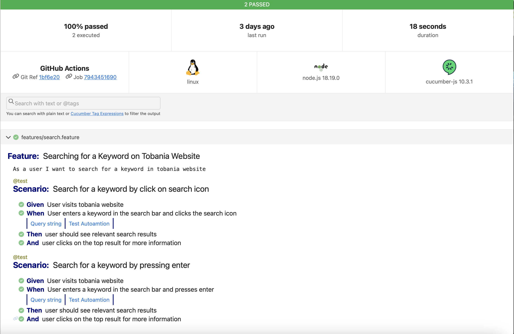

This project demonstrates  automatation of searching for a keyword in [Tobania](https://www.tobania.be/) website

## Regression suite details
The latest regression run details of this project can be viewed [here](https://thulasipavankumar.github.io/tobania-testing/) 

| Branch | Test status    |
| :---:   | :---: | 
| [Main](https://github.com/thulasipavankumar/tobania-testing/tree/main) |    | 
| Most recent run |    | 

## How to run the project
1. Download the project to local machine
2. Open the terminal/command prompt and use the command `npm install` to install dependencies 
3. To run the tests use the command `npm test`
4. After the test run, the results can be accessed in the folder `reports`
5. To change the browser  open the file `cucumber.conf.js` and modify the channel

## Sample screenshot of the [report](https://thulasipavankumar.github.io/tobania-testing/)  

## Pre-requisite for running the project
- minimum node version 18
- minimum npm version 9.8
- A web browser to automate

## Some useful commands
- `npm init playwright` (to initialize playwright template)
- `npx playwright codegen` (to auto-genereate code based on manual actions on browser)

# Why playwright framework

- Cli helper for templates & easy setup
- Microsoft backed project
- Multi browser support inbuilt
- In-built support for test recording  
- Open source with rapidly growing number of user base
- In-built wait conditions
- In-built parallalesim
- In-bult runner 
- Multi-tab support
- Api testing support
- Currently the best open source testing tool in terms of performance

# Contributions
-  `To raise a issue you can click` [here](https://github.com/thulasipavankumar/tobania-testing/issues/new)
